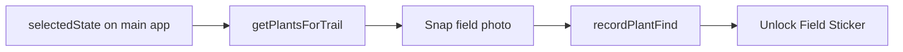

# Kids geo-catch for Field Stickers / cards

## What exists today



- Plants are **region-filtered** by a state code (`STATE_TO_REGION` in [`lib/kidsPlants.ts`](C:\Users\13152\rvchain\lib\kidsPlants.ts)), not by live GPS.
- “Catch” = honor-system **field photo** in [`KidsScavengerHunt.tsx`](C:\Users\13152\rvchain\components\KidsScavengerHunt.tsx) → [`recordPlantFind`](C:\Users\13152\rvchain\lib\kidsProgress.ts).
- No lat/lng stored on finds; no geofence; no AI plant ID (by design — parent-safe demo).
- App already uses `navigator.geolocation` for Community Spots distance (`useMyLocation` on [`app/page.tsx`](C:\Users\13152\rvchain\app\page.tsx)).

## Goal

Make catching feel **location-aware**: local trail lists from GPS, optional “you’re here” proof on each find, without turning into a hardcore anti-cheat product.

---

## Recommended approach (phased)

### Phase 1 — Local trail from GPS (high value, low risk)

1. On Plant Hunt, **“Use my location”** (reuse same permission pattern as map).
2. Map lat/lng → US state (client-side bounds table or coarse reverse-geocode; no paid API required for v1).
3. Pass state into `getPlantsForTrail(stateCode)` so the list matches **where the kid is**, not only the Discover filter.
4. Show: “Trail near **CO** · GPS active” (or deny/fallback to nationwide commons).

**Files:** `KidsScavengerHunt.tsx`, small `lib/geoState.ts` (lat/lng → state), wire optional location from `KidsAdventurePanel`.

### Phase 2 — Geo-tagged catches (proof of adventure)

Extend `PlantFind` in [`kidsProgress.ts`](C:\Users\13152\rvchain\lib\kidsProgress.ts):

```ts
// add optional fields
lat?: number;
lng?: number;
accuracyM?: number;
caughtAt?: string; // already have foundAt
```

On photo mark-found:

1. Call `getCurrentPosition` (or use last known coords from Phase 1).
2. If permission granted: require a fix (e.g. accuracy under ~500 m preferred; soft-fail if denied).
3. Save photo + coords with the find.
4. Unlock Field Sticker as today.

**UX modes (parent-friendly):**

| Mode | Behavior |
|------|----------|
| Field mode (default when GPS on) | Photo + location attached |
| Indoor / no GPS | Photo only; label “no GPS”; still unlocks (don’t brick the game for apartments / denied permission) |

Optional: small **“Field catch”** badge icon on stickers that have coords.

### Phase 3 — True “geo-catch” spawns (Pokemon-Go lite, optional)

Only if you want more game loop:

1. **Spot catches** — when within ~200–500 m of a Community Spot (or saved trip park), unlock a one-time **location sticker** or bonus Trail Badge (not just plants).
2. **Nearby plant pings** — on a mini-map, show 1–3 “look near you” plant prompts from the local trail (not precise AR; just “within this campground area”).
3. **Daily geo quest** — “Catch any plant with GPS today” already fits daily missions if re-enabled.

Keep anti-spoof soft: kids product, not banking. Spoofed GPS is OK at demo quality.

---

## What we will not do in v1

- Real AI plant identification (cost, false negatives, frustration).
- Hard-block catch without GPS (hurts play at home / rainy day).
- Continuous high-accuracy tracking (battery + privacy — request only on hunt open / catch).

## Privacy / parents

- Short copy: “Location is used only to pick local plants and tag your finds on this device.”
- No server upload required for demo (localStorage only, same as today).
- Permission denial → clear fallback, not an error wall.

---

## Approved scope

**Phase 1 + Phase 2** (user choice). Phase 3 deferred.

## Implementation order (when you approve build)

1. `lib/geoState.ts` — lat/lng → state code  
2. Plant Hunt: location button + trail refresh  
3. Extend `PlantFind` + `recordPlantFind` to accept optional coords  
4. Capture GPS on “Snap field photo & mark found”  
5. UI: GPS status chip; sticker detail shows “Caught near lat/lng” or “Field GPS”  
6. Build + ship (no Phase 3 yet)

## Success criteria

- Kid enables location → plant list reflects regional trail.
- Catch with GPS → find stores coords; card unlocks.
- Catch without GPS still works with clear labeling.
- Parents understand location use in one sentence.
