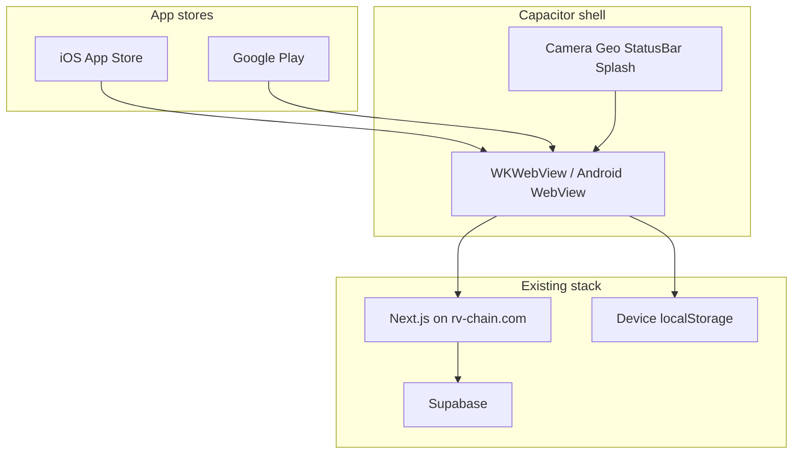

# rvchain → Google Play & App Store

## Goal
Ship **full product parity** (Market, Little Explorers, Trips, Community, Profile, membership demo, games, geo-catch) as installable apps on **Google Play** and the **Apple App Store**.

## Recommendation (best fit for this codebase)

**Use Capacitor to wrap the existing Next.js product**, not a full React Native rewrite.

| Approach | Full parity speed | Risk | Native feel | Fit for rvchain |
|----------|-------------------|------|-------------|-----------------|
| **Capacitor (recommended)** | Weeks | Medium | Good (WebView + plugins) | High — same UI/logic |
| PWA only | Days | Low | No store listing as “app” | Incomplete for your goal |
| React Native / Expo rewrite | Months | High | Best | Only if you later need deep native |

**Why Capacitor**
- You already have a working Next.js 16 + React 19 app (`rvchain`).
- Features (canvas games, Leaflet, Supabase, localStorage, camera, geolocation) already work in a mobile browser.
- Full parity means **one product**, not two codebases to maintain.
- Store shells can load your live site first, then harden offline/plugins over time.

**Architecture (recommended)**



**Ship strategy: remote WebView first (v1), optional bundled assets later**
1. **v1 App** = Capacitor container pointing at `https://rv-chain.com` (or a dedicated app host).
2. **v1.1** = Capacitor plugins for camera, geolocation, safe areas, push (optional).
3. **v2** = Performance polish, offline shell, deeper native bits only where needed.

Avoid rewriting Market + Kids + Trips in RN unless product-market fit demands it after store launch.

---

## Prerequisites (accounts & legal)

| Item | Who | Notes |
|------|-----|--------|
| Apple Developer Program | You | ~$99/year |
| Google Play Console | You | One-time ~$25 |
| Privacy policy URL | Public page | Required by both stores |
| Terms of service | Public page | Strongly recommended |
| Support contact / email | Required | Store listings |
| Kids / COPPA | Careful | If marketed as under-13, Apple/Google Kids rules + privacy are strict. Safer: **“family / ages 9+ with parent”** and avoid “for kids under 13” until counsel/process ready |
| Real payments | Later | App Store IAP rules if you sell digital memberships *inside* the app. Demo memberships are fine; real charges need IAP or external-link policy compliance |

---

## Technical workstreams

### 1. Make the web app “app-ready”
Polish that matters in a WebView:

- [ ] Mobile viewport, safe-area insets (notch, home indicator) — already partial; finish across Market / Kids / Trips
- [ ] No desktop-only dead ends; bottom nav + full flows on phone
- [ ] Geolocation & camera work over **HTTPS** (already on production)
- [ ] Deep links: `https://rv-chain.com/...` and custom scheme `rvchain://`
- [ ] Auth/session: cookies/storage reliable in WebView (test Supabase + localStorage)
- [ ] External links open in system browser where required (store policies)
- [ ] “Demo only” disclosures remain clear (memberships/listings simulated)

### 2. Capacitor project scaffold
New folder e.g. `mobile/` or monorepo root scripts:

```text
npm create @capacitor/app  (or add Capacitor to repo)
npx cap add ios
npx cap add android
```

Config:

- `server.url` = production URL for v1 (or staging)
- App id: e.g. `com.rvchain.app`
- App name: **rvchain** / **RV Chain**
- Icons, splash screens (1024 App Store, adaptive Android icons)

### 3. Native plugins (priority)
| Plugin | Why |
|--------|-----|
| `@capacitor/app` | Back button, lifecycle |
| `@capacitor/status-bar` | Dark UI match |
| `@capacitor/splash-screen` | Store polish |
| `@capacitor/geolocation` | Kids geo-catch + map (permissions) |
| `@capacitor/camera` | Field photos (if file input is flaky in WebView) |
| `@capacitor/browser` | Open external URLs safely |
| `@capacitor/haptics` | Optional game juice |
| Push (later) | FCM / APNs — not required for v1 |

Bridge pattern: feature-detect Capacitor in web code; fall back to browser APIs on the website.

### 4. Store compliance checklist
- [ ] Privacy policy covering location, photos, account data, local storage
- [ ] Account deletion path (if accounts exist) — Apple requires this
- [ ] Age rating questionnaire (travel + user-generated content + location)
- [ ] Screenshots for phone sizes (6.7", 6.5", Android phones/tablets as needed)
- [ ] App description, keywords, category (Travel / Lifestyle)
- [ ] Export compliance / encryption questionnaire (standard HTTPS)
- [ ] Content rights for marketplace images / badge art

### 5. Build & release pipeline
**Android**
- Android Studio, signing keystore, AAB upload to Play Console
- Internal testing track → closed → production

**iOS**
- Mac + Xcode required for archive/upload (or CI with Mac runners)
- TestFlight → App Review → release
- Capabilities: Location When In Use, Camera, Photo Library usage strings in `Info.plist`

**CI (optional v1.1)**
- GitHub Actions for Android; Mac cloud for iOS later

---

## Phased roadmap

### Phase A — Foundations (1–2 weeks)
- Privacy policy + support page on site
- Safe areas / WebView QA on real devices
- Capacitor project, icons, splash, `server.url` → production
- Internal Android build + iOS simulator/TestFlight internal

### Phase B — Store pilot (2–4 weeks)
- Geolocation + camera permissions wired
- Back button, splash, status bar
- Store listings, screenshots
- Play **internal/closed** testing; **TestFlight** external testers
- Fix review feedback

### Phase C — Public launch
- Production tracks on both stores
- Monitor crashes (Sentry optional), review replies
- Soft-launch marketing

### Phase D — Post-launch (only if needed)
- Offline shell / faster cold start
- Push notifications
- Real IAP for membership (if leaving demo mode)
- Selective native screens (map) if WebView perf becomes a problem

---

## What you will need (non-code)
1. Apple Developer account (Mac access for iOS builds — yours or a hire/CI)
2. Google Play Console account
3. Decision on **app name** and **bundle id**
4. Privacy policy content (can draft from current demo data practices)
5. Brand assets: icon, feature graphic (Play), screenshots

---

## Risks & mitigations

| Risk | Mitigation |
|------|------------|
| App Review rejects “thin” WebView wrapper | Add native splash, permissions usage copy, offline error page, distinct app value messaging; don’t look like a bare bookmark |
| Kids category / COPPA | Market as family travel + parent-supervised explorers; avoid under-13 Kids category until ready |
| IAP if selling memberships in-app | Keep demo free for v1; real billing plan with Apple/Google compliance later |
| No Mac for iOS | Use a Mac, cloud Mac CI, or contractor for first archive |
| WebView file input camera flaky | Capacitor Camera plugin fallback for plant hunt |

---

## Success criteria
- Installable app from TestFlight + Play internal track
- Full site flows work inside the app (sign-in, Market, Kids hunt + games, Trips, map)
- Location + camera permission prompts appear correctly
- Privacy policy linked in stores and in-app
- Public listing approved (or clear path after first review cycle)

---

## Immediate next step when you approve implementation
1. Create `mobile/` Capacitor app with id `com.rvchain.app` (or your chosen id)
2. Point at production URL
3. Generate Android debug build you can install on a phone
4. Document Mac/Xcode steps for iOS
5. Draft privacy policy page on the Next site

No React Native rewrite in v1 unless you later change strategy after launch data.
